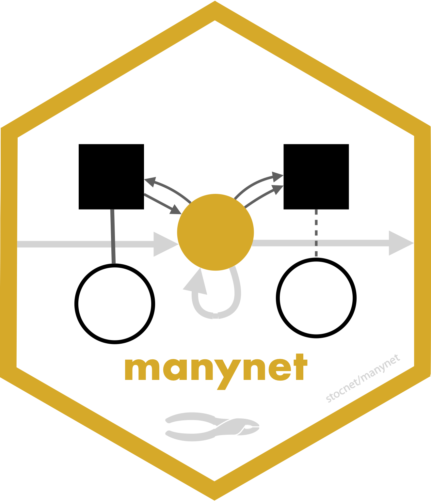

<!-- README.md is generated from README.Rmd. Please edit that file -->

# manynet



<!-- badges: start -->

[](https://lifecycle.r-lib.org/articles/stages.html#maturing)
  
[](https://app.codecov.io/gh/stocnet/manynet?branch=main)
<!-- [](https://www.codefactor.io/repository/github/stocnet/manynet) -->
<!-- [](https://bestpractices.coreinfrastructure.org/projects/4559) -->
<!-- [](https://doi.org/10.5281/zenodo.7076396) -->
<!-- see https://zenodo.org/record/7076396 -->
<!--  -->
<!-- badges: end -->

## About the package

While many awesome packages for network analysis exist for R, all with
their own offerings and advantages, they also all have their own
vocabulary, syntax, and expected formats for data inputs and analytic
outputs. Many of these packages only work on *some* types of networks
(usually one-mode, simple, directed or undirected networks) for *some*
types of analysis; if you want to analyse a different type of network or
try a different analysis, a different package is needed. This can make
learning and using network analysis tools in R challenging.

By contrast, `{manynet}` offers *many* tools that help researchers make,
manipulate, and modify *many* (if not most) types and kinds of networks,
including matrices, edgelists, and objects from other packages such as
`{igraph}`, `{network}`, `{tidygraph}`, `{diffnet}`, and `{siena}`, as
well as one-mode and two-mode, directed and undirected, weighted,
unweighted, and signed, longitudinal and dynamic networks. If you have
social network data, `{manynet}` probably has the tools to help you work
with it.

- [Making](#making)
  - [Importing network data](#importing-network-data)
  - [Identifying network data](#identifying-network-data)
  - [Inventing network data](#inventing-network-data)
- [Manipulating](#manipulating)
  - [Translating network data](#translating-network-data)
- [Modifying](#modifying)
  - [Reformatting](#reformatting)
  - [Transforming](#transforming)
  - [Splitting and Joining](#splitting-and-joining)
  - [Extracting](#extracting)
- [Installation](#installation)
  - [Stable](#stable)
  - [Development](#development)
- [Relationship to other packages](#relationship-to-other-packages)
- [Funding details](#funding-details)

## Making

Networks can come from many sources and be found in many different
formats: some can be found in this or other packages, some can be
created or generated using functions in this package, and others can be
downloaded from the internet and imported from your file system.
`{manynet}` provides tools to make networks from all these sources in
any number of common formats.

#### Importing network data

`{manynet}` offers a number of options for importing network data found
in other repositories. Besides importing and exporting to Excel
edgelists, nodelists, and (bi)adjacency matrices, there are specific
routines included for
[UCINET](http://www.analytictech.com/archive/ucinet.htm),
[Pajek](http://mrvar.fdv.uni-lj.si/pajek/), and
[GraphML](https://w.wiki/_cgC5) files, e.g.:


If you cannot remember the file name/path, then just run `read_*()` with
the parentheses empty, and a file selection popup will open so that you
can browse through your file system to find the file. Usually both
`read_*()` and `write_*()` are offered to make sure that `{manynet}` is
compatible with your larger project and analytic workflow.

- `read_cran()`, `read_dynetml()`, `read_edgelist()`, `read_gdf()`,
  `read_gml()`, `read_graphml()`, `read_matrix()`, `read_nodelist()`,
  `read_pajek()`, `read_pkg()`, `read_ucinet()`
- `write_edgelist()`, `write_graphml()`, `write_matrix()`,
  `write_nodelist()`, `write_pajek()`, `write_ucinet()`

#### Identifying network data

There may be no need to import network data though, if that network data
already exists in a package in R. To facilitate testing and to
contribute to an ecosystem of easily accessible network data,
particularly for pedagogical purposes, we include a number of classical
and instructional network datasets, all thoroughly documented and ready
for analysis. Here are just a few examples, all available in
`{manynet}`:


The package includes three families of network data:

- Classic/instructional networks: `ison_adolescents`, `ison_algebra`,
  `ison_brandes`, `ison_dolphins`, `ison_emotions`, `ison_hightech`,
  `ison_judo_moves`, `ison_karateka`, `ison_koenigsberg`,
  `ison_laterals`, `ison_lawfirm`, `ison_monks`, `ison_networkers`,
  `ison_physicians`, `ison_southern_women`
- Fictional networks: `fict_actually`, `fict_friends`, `fict_greys`,
  `fict_lotr`, `fict_marvel`, `fict_potter`, `fict_starwars`,
  `fict_thrones`
- International/political networks: `irps_911`, `irps_blogs`,
  `irps_books`, `irps_nuclear`, `irps_revere`, `irps_usgeo`, `irps_wwi`

#### Inventing network data

`{manynet}` includes functions for making networks algorithmically. The
`create_*` group of functions create networks with a particular
structure, and will always create the same format from the same inputs,
e.g.:


See also `create_components()`, `create_core()`, `create_cycle()`,
`create_degree()`, `create_empty()`, `create_explicit()`,
`create_filled()`, `create_lattice()`, `create_motifs()`,
`create_ring()`, `create_star()`, `create_tree()`, `create_wheel()`,
`create_windmill()`.

The `generate_*` group of functions generate networks from generative
mechanisms that may include some random aspect, and so will return a
different output each time they are run, e.g.:


See also `generate_citations()`, `generate_configuration()`,
`generate_fire()`, `generate_islands()`, `generate_man()`,
`generate_random()`, `generate_scalefree()`, `generate_smallworld()`,
`generate_utilities()`.

Note that all these functions can create directed or undirected,
one-mode or two-mode networks. Creating two-mode networks is as easy as
passing the first argument (`n`) a vector of two integers instead of
one. For example, while `n = 15` will create a one-mode network of 15
nodes, whereas `n = c(10,5)` will create a two-mode network of 10 nodes
in the first mode, and 5 nodes in the second mode. Some of these
functions wrap existing algorithms in other packages, while others are
unique offerings or add additional formats, e.g. two-mode networks.


#### Inventing data on networks

`{manynet}` also includes functions for simulating diffusion or learning
processes over a given network:

- `play_diffusion()`, `play_learning()`, `play_segregation()`

The diffusion models include not only SI and threshold models, but also
SIS, SIR, SIRS, SEIR, and SEIRS. These simulations return results that
can be analysed with the network-level and node-level diffusion measures
in `{netrics}`.

## Manipulating

`{manynet}` offers comprehensive tools for manipulating networks,
including coercing between formats and using familiar dplyr-style verbs
to work with nodes, ties, and their attributes.

#### Translating network data

Once you have imported network data, identified network data in this or
other packages in R, or invented your own, you may need to translate
this data into another class for analysis. `{manynet}`’s `as_*()`
functions can be used to coerce objects from one of many common classes
into any other. Below is a directed graph showing the currently
available options:


These functions are designed to be as intuitive and lossless as
possible, outperforming many other class-coercion packages.

We use these functions internally in every `{manynet}`, `{autograph}`,
`{netrics}`, and `{migraph}` function to (1) allow them to be run on any
compatible network format and (2) use the most efficient algorithm
available. This makes all these packages compatible with your existing
workflow, whether you use base R matrices or edgelists as data frames,
[`{igraph}`](https://igraph.org/r/), [`{network}`](https://statnet.org),
or [`{tidygraph}`](https://tidygraph.data-imaginist.com/index.html), and
extensible by developments in those other packages too.

#### Wrangling with dplyr-style verbs

`{manynet}` offers a set of dplyr-inspired verbs for working directly
with network nodes, ties, and their attributes. These verbs follow the
familiar tidyverse grammar, making network manipulation intuitive for R
users:

``` r
ison_southern_women %>%
  mutate_ties(weight = 1) %>%
  filter_nodes(node_is_mode(ison_southern_women)) %>%
  select_nodes(name)
```

Available verbs for manipulating **nodes**: `mutate_nodes()`,
`filter_nodes()`, `select_nodes()`, `rename_nodes()`, `arrange_nodes()`,
`bind_nodes()`, `add_nodes()`, `delete_nodes()`, `join_nodes()`

Available verbs for manipulating **ties**: `mutate_ties()`,
`filter_ties()`, `select_ties()`, `rename_ties()`, `arrange_ties()`,
`bind_ties()`, `add_ties()`, `delete_ties()`, `join_ties()`

Available verbs for manipulating **changes**: `add_changes()`,
`apply_changes()`, `arrange_changes()`, `bind_changes()`,
`collect_changes()`, `delete_changes()`, `describe_changes()`,
`filter_changes()`, `gather_changes()`, `mutate_changes()`,
`rename_changes()`, `select_changes()`

Available verbs for manipulating **globals**: `mutate_globals()`,
`rename_globals()`, `select_globals()`

## Modifying

Before or during analysis, you may need to modify the structure of the
network you are analysing. `{manynet}`’s `to_*()` functions can be used
on any class object to reformat, transform, or split networks into
networks with other properties.

### Reformatting

Reformatting means changing the format of the network, e.g. from
directed to undirected via `to_undirected()`.


See also `to_directed()`, `to_named()`, `to_permuted()`,
`to_reciprocated()`, `to_redirected()`, `to_signed()`,
`to_undirected()`, `to_unnamed()`, `to_unsigned()`, `to_unweighted()`,
`to_weighted()`.

### Transforming

Transforming means changing the dimensions of the network, e.g. from a
two-mode network to a one-mode projection via `to_mode1()` or
`to_mode2()`.


Compared with other packages, `{manynet}`’s `to_mode1()` and
`to_mode2()` functions are more flexible and efficient, work with all
input classes, offer additional weighting options (such as Jaccard or
cosine normalisation), and retain node and edge attributes.

### Splitting and Joining

Splitting means separating a network, e.g. from a whole network to the
various ego networks via `to_egos()`.


Those functions that split a network into a list of networks are
distinguishable as those `to_*()` functions that are named in the
plural. Split data can be rejoined using the `from_*()` family of
functions.

See also `to_blocks()`, `to_components()`, `to_egos()`,
`to_no_isolates()`, `to_slices()`, `to_subgraphs()`, `to_ties()`,
`to_waves()` and `from_egos()`, `from_slices()`, `from_subgraphs()`,
`from_ties()`, `from_waves()`.

## Installation

### Stable

The easiest way to install the latest stable version of `{manynet}` is
via CRAN. Simply open the R console and enter:

`install.packages('manynet')`

`library(manynet)` will then load the package and make the data and
tutorials (see below) contained within the package available.

### Development

For the latest development version, for slightly earlier access to new
features or for testing, you may wish to download and install the
binaries from Github or install from source locally. The latest binary
releases for all major OSes – Windows, Mac, and Linux – can be found
[here](https://github.com/stocnet/manynet/releases/latest). Download the
appropriate binary for your operating system, and install using an
adapted version of the following commands:

- For Windows:
  `install.packages("~/Downloads/manynet_winOS.zip", repos = NULL)`
- For Mac:
  `install.packages("~/Downloads/manynet_macOS.tgz", repos = NULL)`
- For Unix:
  `install.packages("~/Downloads/manynet_linuxOS.tar.gz", repos = NULL)`

To install from source the latest main version of `{manynet}` from
Github, please install the `{remotes}` package from CRAN and then:

- For latest stable version:
  `remotes::install_github("stocnet/manynet")`
- For latest development version:
  `remotes::install_github("stocnet/manynet@develop")`

### Other sources

Those using Mac computers may also install using Macports:

`sudo port install R-manynet`

## Relationship to other packages

This package stands on the shoulders of several incredible packages.

In terms of the objects it works with, this package aims to provide an
updated, more comprehensive replacement for `{intergraph}`. As such it
works with objects in `{igraph}` and `{network}` formats, but also
equally well with base matrices and edgelists (data frames), and formats
from several other packages.

The user interface is inspired in some ways by Thomas Lin Pedersen’s
excellent `{tidygraph}` package, though makes some different decisions,
and uses the quickest `{igraph}` or `{network}` routines where
available.

`{manynet}` has inherited most of its core functionality from its
maternal package, `{migraph}`, but has also devolved its visualisation
capabilities to its sibling package,
[`{autograph}`](https://stocnet.github.io/autograph/), and its network
analytic capabilities to its sibling package,
[`{netrics}`](https://stocnet.github.io/netrics/).
[`{migraph}`](https://stocnet.github.io/migraph/) continues to offer
modelling functions that builds upon the architecture provided by
`{manynet}`. For more, please check out `{migraph}` and the other
[stocnet](https://github.com/stocnet) packages directly.

## Funding details

Development on this package has been funded by the Swiss National
Science Foundation (SNSF) [Grant Number
188976](https://data.snf.ch/grants/grant/188976): “Power and Networks
and the Rate of Change in Institutional Complexes” (PANARCHIC).
